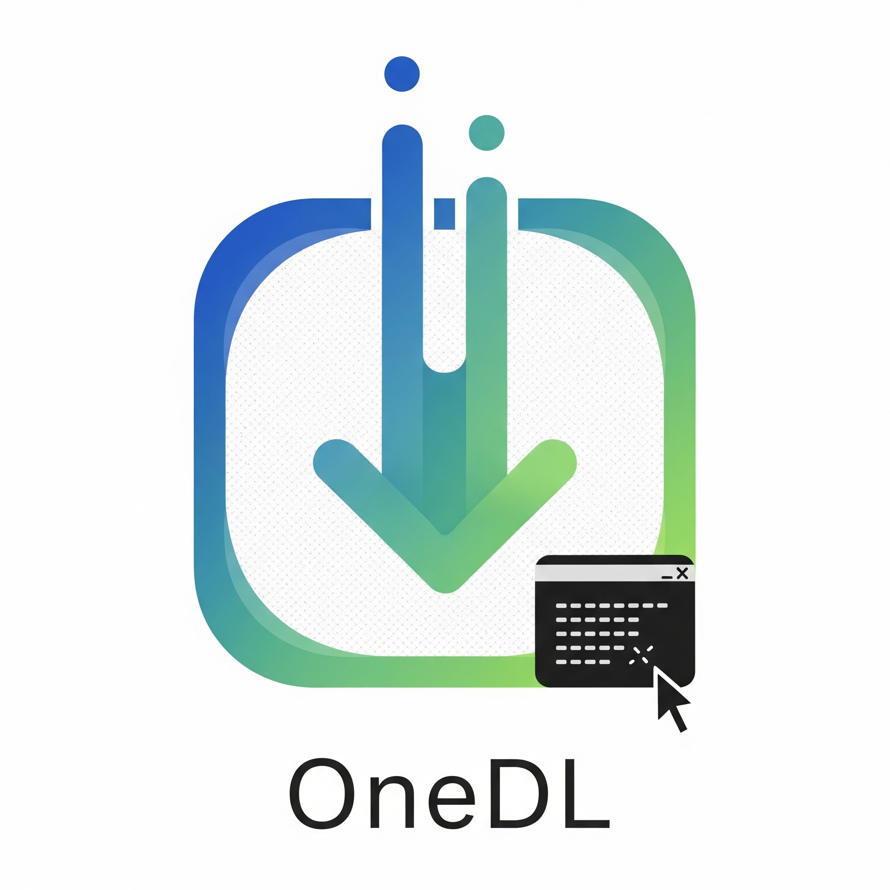
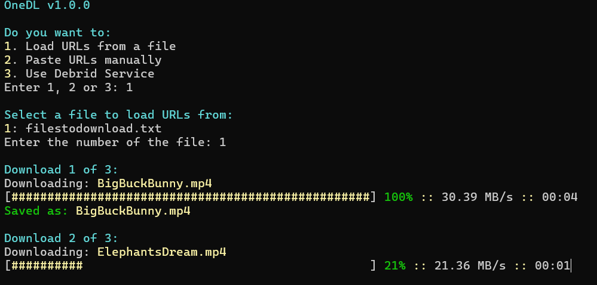
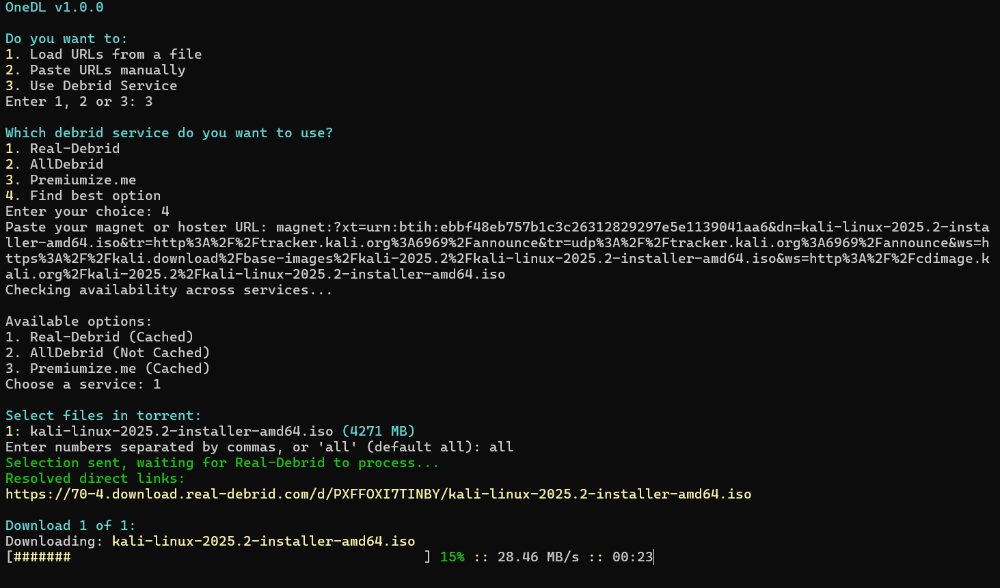

# OneDL

<p align="left">
  
</p>

**OneDL** is a universal downloader for the command line — a single tool to download content via torrents, hosters, MEGA folders, and direct HTTP(S) links with support for Real-Debrid, AllDebrid, Premiumize.me and TorBox.

Whether you're pasting a magnet link or unlocking hoster URLs, OneDL handles everything from resolving links to downloading files with a clean, interactive terminal interface.

---

## ✨ Features

- ✅ Supports **magnet links**, **hoster URLs**, **MEGA folders**, and **direct HTTP(S)** links  
- ✅ Integrates with:
  - [Real-Debrid](https://real-debrid.com/)
  - [AllDebrid](https://alldebrid.com/)
  - [Premiumize.me](https://www.premiumize.me/)
  - [Torbox](https://torbox.app/)
- ✅ Automatically finds the best debrid service for your link  
- ✅ Lets you select specific files from torrents and containers  
- ✅ Shows real-time download progress with speeds  
- ✅ Works entirely from your terminal — no GUI needed

---

## 🛠️ Installation

### 1. Install Python

Make sure **Python 3** is installed:

```bash
python3 --version
```

If it's not installed, download it from [python.org](https://www.python.org/downloads/) or install it using your system’s package manager.

### 2. Install Required Package

The only required external Python package is `requests`. Install it with:

```bash
pip install requests
```

> Use `pip3` if you're on a system where `pip` refers to Python 2.

### 3. Download the Script

Download `OneDL.py` directly from GitHub:

```bash
curl -o OneDL.py https://raw.githubusercontent.com/ellite/OneDL/refs/heads/main/OneDL.py
chmod +x OneDL.py
```

### 4. Make It Globally Accessible (Optional)

To make `onedl` available from any folder, create a hard link:

```bash
sudo ln OneDL.py /usr/local/bin/onedl
```

Now you can simply run:

```bash
onedl
```

---

## 🚀 Usage

1. Run the script:

    ```bash
    onedl
    ```

2. Choose how to provide your links:
   - Load from a file
   - Paste manually
   - Use a debrid service

3. If using a debrid service:
   - Select Real-Debrid, AllDebrid, Premiumize.me, TorBox, or "Find best option"
   - Paste your magnet, hoster, or HTTP(S) URL when prompted

4. Select specific files (if applicable), and OneDL will download them to your current folder.

---

## 🔐 API Configuration

At the top of the `OneDL.py` script, configure your API tokens:

```python
REAL_DEBRID_API_TOKEN = "your_real_debrid_token"
ALLDEBRID_API_TOKEN = "your_alldebrid_token"
PREMIUMIZE_API_TOKEN = "your_premiumize_token"
TORBOX_API_TOKEN = "your_torbox_token"
```

Tokens are optional — just set the ones you have access to.

---




---

## 📄 License

AGPLv3
